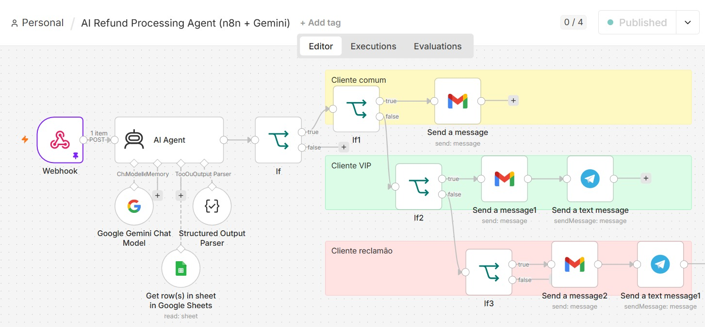

# 💰 AI Refund Processing Agent

An AI-powered workflow built with **n8n** and **Google Gemini** that automates the analysis of refund requests using customer information and predefined business rules.

---

## 🚀 Overview

This workflow receives refund requests through a webhook, analyzes customer information using Google Gemini, consults customer data stored in Google Sheets, and automatically routes each request according to predefined conditions.

Depending on the analysis, notifications are sent through Gmail and Telegram.

---

## 🛠️ Technologies

- n8n
- Google Gemini
- AI Agent
- Structured Output Parser
- Google Sheets
- Gmail
- Telegram
- Webhooks

---

## 📊 Workflow

```text
Webhook
   │
   ▼
AI Agent
   │
   ▼
Business Rules
   │
   ├── Standard Customer
   │      └── Gmail
   │
   ├── VIP Customer
   │      ├── Gmail
   │      └── Telegram
   │
   └── Customer Complaint
          ├── Gmail
          └── Telegram
```

---

## 📸 Workflow Preview



---

## ⚙️ How It Works

1. Receives a refund request through a Webhook.
2. Uses Google Gemini to analyze the request.
3. Retrieves customer information from Google Sheets.
4. Applies business rules based on the customer profile.
5. Automatically sends notifications using Gmail and Telegram.

---

## 📂 Files

| File | Description |
|------|-------------|
| `workflow.json` | n8n workflow ready to import |
| `workflow-preview.png` | Workflow preview image |
| `README.md` | Project documentation |

---

## 📥 Import into n8n

1. Download `workflow.json`.
2. Open n8n.
3. Select **Import from File**.
4. Configure your credentials.
5. Execute the workflow.

> **Note:** Credentials are not included in the exported workflow.
